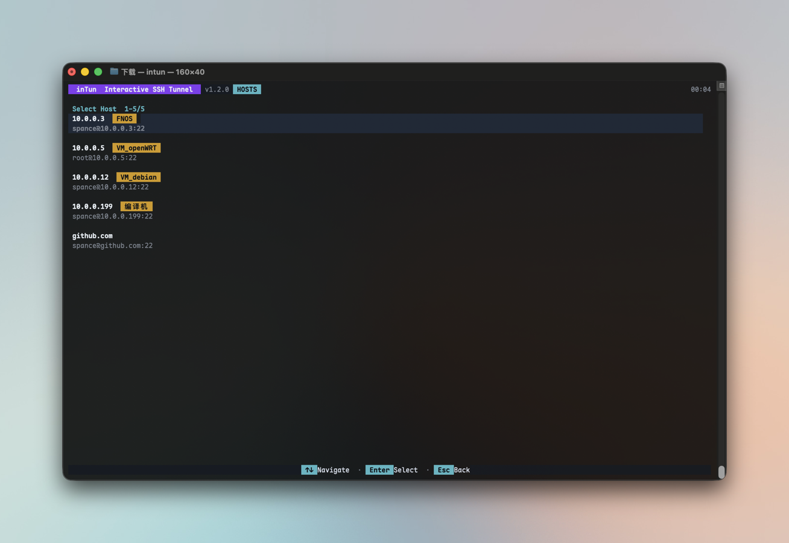

# inTun

[English](README.md) | [简体中文](README_CN.md)

Interactive SSH Tunnel - 跨平台 SSH 隧道管理器，基于纯 Go 实现，提供现代化 TUI 界面。

[](https://golang.org)
[](LICENSE)

## 界面预览



## 功能特性

- **TCP 与 UDP 转发**：本地与远程 TCP/UDP 转发，以及动态 SOCKS5 TCP 代理 (-D)
- **纯 Go SSH 实现**：不依赖系统 ssh/plink，完全跨平台
- **实时监控**：上下行流量统计 (TX/RX)、传输速率、网络延迟
- **自动配置**：解析 `~/.ssh/config` 自动发现主机
- **标签分组**：解析 `#!! GroupLabels` 注释，支持主机标签和过滤
- **交互式主机密钥验证**：可视化界面接受或拒绝未知主机密钥
- **密码认证**：通过 TUI 交互式输入密码，支持键盘交互式认证
- **连接健康检测**：SSH/TCP 双重保活，连接断开自动提示重连
- **远程隧道 LAN 目标**：本地目标和远程监听均支持 `ip:port` 格式
- **内置 SFTP 管理器**：本地/远程双面板浏览，支持文件同步、目录同步、重命名、预览和传输结果确认
- **键盘驱动界面**：快捷键操作，高效导航

## 安装

### 从源码构建

```bash
git clone https://github.com/spance/intun.git
cd intun
make build

# 或交叉编译所有平台
make all
```

### 系统安装

```bash
make install    # 构建并复制到 /usr/local/bin/
```

### 预编译二进制

从 [Releases](https://github.com/spance/intun/releases) 页面下载最新版本。

## 快速开始

启动 intun：

```bash
./intun
```

### 创建隧道

1. 按 `c` 创建新隧道
2. 从 `~/.ssh/config` 列表中选择主机
3. 选择隧道类型：
   - **本地 TCP**：将本地 TCP 端口转发至远程服务
   - **本地 UDP**：通过 SSH 将本地 UDP 数据报中继至远程 UDP 服务
   - **远程 TCP**：将远程 TCP 端口转发至本地服务（支持 LAN 目标地址）
   - **远程 UDP**：开放远端 UDP 端口，并将数据报中继至本地 UDP 服务
   - **动态 TCP**：创建 SOCKS5 TCP 代理
4. 按提示输入端口号

### 协议模型

每条隧道只包含一个方向和一种协议。TCP 与 UDP 隧道彼此独立，可以同时运行；由于操作系统分别维护 TCP 和 UDP 端口空间，两条不同协议的隧道也可以使用相同的数字端口。

| 隧道类型 | 监听端 / 客户端侧 | 目标端 |
|----------|-------------------|--------|
| 本地 TCP | 本机 TCP 监听端口 | 远端 TCP 服务 |
| 本地 UDP | 本机 UDP 客户端 | 远端 UDP 服务 |
| 远程 TCP | 远端 TCP 监听端口 | 本机 TCP 服务 |
| 远程 UDP | 远端 UDP 客户端 | 本机 UDP 服务 |
| 动态 TCP | 本机 SOCKS5 监听端口 | 远端可达的 TCP 目标 |

UDP 转发使用带长度边界的数据报协议封装在 SSH session 中，远端主机的 `PATH` 中必须安装兼容版本的 `intun`。该模式保留 UDP 数据报边界，但 SSH 底层仍为 TCP，会受到队头阻塞影响；适合 DNS、监控和控制流量，不适合对延迟敏感的音视频、游戏或 QUIC。

远程 UDP 仅输入端口时默认绑定 `127.0.0.1`。显式填写 `0.0.0.0:5353` 等非回环地址会按照远端账户权限和主机防火墙对 LAN 或公网暴露。UDP listener 由远端 `intun` 进程直接创建，因此不受 OpenSSH `GatewayPorts` 和 `AllowTcpForwarding` 控制。

远程 UDP 是有状态中继：每个远端来源使用独立的本地 UDP socket，但本地目标看到的是 inTun 的本地源地址，而不是原始远端客户端地址。当前不支持广播和组播转发。

### 快捷键

主界面：

| 按键 | 操作 |
|------|------|
| `c` | 创建隧道 |
| `r` | 重新连接 |
| `s` | 停止/启动 |
| `d` | 删除隧道 |
| `f` | 为运行中的隧道打开 SFTP 文件管理器 |
| `↑↓` | 导航选择 |
| `e` | 退出 |

SFTP 界面：

| 按键 | 操作 |
|------|------|
| `Tab` | 切换本地/远程面板 |
| `↑↓` / `PgUp` / `PgDn` | 导航并滚动文件列表 |
| `Enter` | 进入目录或返回父目录 |
| `s` | 按当前激活面板方向同步选中文件 |
| `r` | 二次确认后递归同步选中目录 |
| `n` | 重命名选中项 |
| `v` | 预览选中文件 |
| `q` / `Esc` | 关闭预览或退出 SFTP |
| `Enter` / `Esc` | 确认传输结果通知 |

## 系统要求

- Go 1.21+（构建时）
- SSH 私钥：`~/.ssh/id_rsa`、`id_ed25519` 或 `id_ecdsa`，或使用密码认证
- SSH 配置文件：`~/.ssh/config`（可选，用于主机发现）
- 远端 SSH 服务启用 SFTP 子系统（仅使用 SFTP 管理器时需要）
- 远端 `PATH` 中存在兼容版本的 `intun`（使用 UDP 转发时需要）

## 配置

intun 自动读取 `~/.ssh/config`：

```ssh
Host myserver
    Hostname example.com
    User root
    Port 2222
    IdentityFile ~/.ssh/custom_key
    #!! GroupLabels production web
```

支持字段：
- `Host` - 别名
- `Hostname` - 实际主机地址
- `User` - 用户名
- `Port` - 端口（默认 22）
- `IdentityFile` - 私钥路径
- `#!! GroupLabels` - 标签（以金色高亮显示）

## 技术架构

- **UI 框架**: [bubbletea](https://github.com/charmbracelet/bubbletea) (Charm TUI)
- **SSH 库**: [golang.org/x/crypto/ssh](https://pkg.go.dev/golang.org/x/crypto/ssh)
- **SFTP 库**: [github.com/pkg/sftp](https://github.com/pkg/sftp)
- **样式渲染**: [lipgloss](https://github.com/charmbracelet/lipgloss)
- **转发模型**: 每条隧道持有一个方向/协议规格，再分派给相互独立的 TCP 或 UDP 实现
- **UDP 中继**: 通过 SSH session 传输带版本和长度边界的 UDP 帧，支持客户端 association 映射与空闲回收
- **UDP 角色**: `PeerRelay` 负责监听端口和客户端 association，`TargetRelay` 为每个 association 管理独立的目标 socket；本地与远程模式会交换两种角色所在的位置
- **统计监控**: 1秒间隔采样，5秒间隔 SSH 探测，TX/RX 总量 + ↑↓ 速率指示
- **TUI 安全性**: 共享 modal 弹窗、SFTP 传输结果确认、可取消的 SFTP 操作、串行化 SFTP 客户端访问

## 开发

```bash
# 本地构建
make build

# 运行测试
make test

# 注入版本号
VERSION=$(git describe --tags)
go build -ldflags "-X main.Version=$VERSION" ./cmd/intun

# 交叉编译
make all    # 全平台编译
```

### 发布检查

发布前需要运行测试，并扫描已跟踪文件中的敏感信息。凭据、私钥、token、本地文件系统路径、用户名、机器名、私有主机名和私有域名都应视为发布阻断项。文档和测试示例应使用 `example.com`、`/path/to/project`、`user` 等占位内容。

### 调试

设置 `INTUN_LOG` 环境变量启用 SSH 连接诊断日志：

```bash
INTUN_LOG=/tmp/intun.log ./intun
```

## 项目结构

```
cmd/intun/
  └── main.go              # 入口程序

internal/
  ├── config/              # SSH 配置解析 + GroupLabels
  ├── platform/            # SSH 连接、主机密钥管理、Mock 测试
  ├── tunnel/              # 隧道生命周期管理（线程安全）
  ├── monitor/             # 统计监控（同步更新）
  ├── sftp/                # SFTP 读写、同步、预览、重命名
  ├── udprelay/            # UDP 帧协议、角色中继、association 生命周期
  └── tui/                 # TUI 模型、共享 modal、SFTP 动作与渲染
```

## 许可协议

MIT License - 详见 [LICENSE](LICENSE) 文件。
